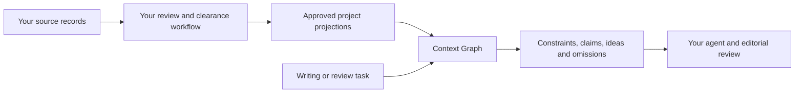

# Context Graph

Give an agent a small, traceable packet of project knowledge before it writes or reviews something.

A team can have good source material and still get generic or contradictory output: the useful decision is in one document, the current product facts in another, and the explanation behind them somewhere else. Context Graph connects those records and serves the part a task needs. It keeps instructions, documented claims, and possible inspiration visibly separate.

**Status: experimental 0.1 integration release.** The source is public and MIT licensed. The October 6, 2026 baseline assessment found no npm release; check the [release workflow](https://github.com/LucentiveLabs/context-graph/actions/workflows/release.yml) for subsequent publication and verification. The source quickstart below works independently of registry availability. Working interfaces do not establish retrieval effectiveness or better writing.



Your application owns the sources and review decisions. This package supplies the graph core, projection reader, command-line interface, portable agent skill, and optional read-only Model Context Protocol (MCP) server. It does not download books or podcasts, run a model, maintain your source library, or publish content.

## Try it from source

Requires Node.js **22.13 or newer** and npm. The commands use synthetic data and need no model-provider credentials.

```sh
git clone https://github.com/LucentiveLabs/context-graph.git
cd context-graph
npm ci --ignore-scripts
node bin/context-graph.mjs status --root examples/minimal
node bin/context-graph.mjs context --root examples/minimal --task 'Explain the sample product' --product sample
npm test
```

The bundle contains the sample definition, a naming rule, an optional idea, and an explicit inaccessible-item notice. Try `--budget 1`: the binding requirements remain complete, while optional material is reported as omitted. A byte budget is not a hard limit on mandatory context.

Once a registry release has been verified, the intended installation is `npm install @lucentive-labs/context-graph`. Track release attempts in [GitHub Actions](https://github.com/LucentiveLabs/context-graph/actions/workflows/release.yml). Source availability and npm availability are separate states.

## Read next

| I want to... | Start here |
|---|---|
| Understand the idea without graph terminology | [How it works](docs/architecture.md) |
| Try it, check text, or connect an agent | [Getting started](docs/getting-started.md) |
| Build an integration or understand projection fields | [Interface reference](docs/reference.md) |
| Use source material to improve writing and measure value | [Writing with context](docs/writing.md) |
| Contribute, verify a change, or release | [Contributing](CONTRIBUTING.md) |
| Understand the trust boundary or report a vulnerability | [Security](SECURITY.md) |

## What it guarantees, and what it does not

The projection client rejects missing, malformed, inconsistent, escaped, and expired registered projections. Library, CLI, and MCP use the same selection and check functions. Selected binding requirements survive budget pressure; optional budget omissions are listed. Paths passed to `check` label supplied text and are not opened as files.

A content hash identifies bytes. It does not prove that the source is true, that someone approved it, or that it can be published. A team projection is readable by every user and process with access to its files. Clear material before putting it there.

Selection is deterministic and based on product, section priority, and word overlap. This is not semantic search over an entire library. In 0.1, include `story` to receive acceptance requirements and optional ideas. Without `story`, both `library` and `governance` return only binding terms, definitions, and decisions; acceptance requirements are omitted without a report entry. Read [current limits and evaluation](docs/writing.md#current-selection-limits) before relying on the output.

## Development

```sh
npm ci --ignore-scripts
npm test
npm run check:pack
npm audit --omit=dev --audit-level=high
bash scripts/security-scan.sh --mode full
```

Release runs from reviewed `main` through npm trusted publishing. It verifies the exact tarball, registry revision, install/import behavior, and cryptographic signatures. No local publishing token is part of this lane. See [release and maintenance](CONTRIBUTING.md#release-and-maintenance).
