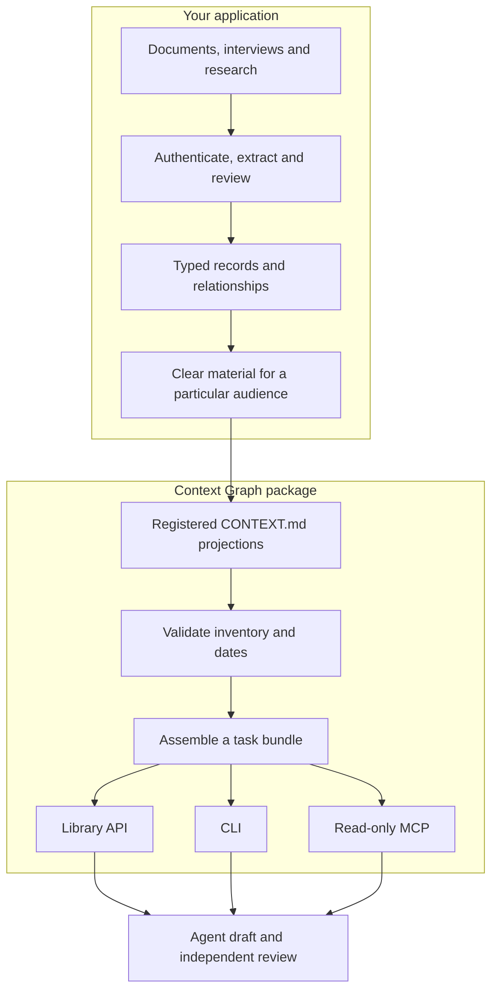

# How it works

Think of a context graph as a well-indexed research notebook. A record says what something is. A relationship says how two records connect. The source stays where it belongs; the graph records where it came from and what kind of connection is justified.

For example, a project decision can require a particular product name. A product document can state what a feature does. A book can suggest a useful way to explain it. Those three things have different authority. A book idea must not silently become a product promise or a team instruction.

## The three layers

The low-level graph modules also support building and validating the typed records in the application layer, through application-provided adapters. The simple projection client starts at the `CONTEXT.md` files; it does not require a database or the private graph.

**Source record:** original evidence, owned by your application. **Node:** a typed record about a source, decision, concept, product, or claim. **Edge:** a typed relationship, such as a claim belonging to a document. **Projection:** a reviewed subset prepared for an audience. **Bundle:** the subset of projections returned for one task. **Handle:** an opaque identifier such as `ctx:22222222`, useful for tracing an item through your own application.

## A request from start to finish

1. The client opens the parent projection and every file in its registry. It checks path confinement, shape, identity, duplicate consistency, and expiry. An unrelated expired registered file also blocks the workspace request.
2. It selects the parent plus the explicitly named product projections. The simple client does not infer product IDs from the task.
3. With `story`, it keeps binding terms, definitions, decisions, and acceptance items. Optional sections follow in fixed section order; word overlap ranks items within each section. Without `story`, it selects only binding terms, definitions, and decisions; acceptance and optional items are excluded without omission notices.
4. It returns text, a hash, selected items, and an omission report. The caller reads the report before using the bundle.
5. The application reviews the output against current product evidence and publication permissions. Deterministic text checks can find declared patterns; they cannot establish that a story is good or a claim is true.

The generic core supports deeper graph operations: validation, traversal, provenance, projection generation, leak scanning, propagation planning, and intent handoffs. Applications supply authenticated sources, policies, capture resolution, and contract validators. `intent` delegates card validation and lineage to the consumer's contract adapter instead of defining another card schema.

## Trust and freshness

Binding context is only as trustworthy as the process that authored and cleared the projection. The package validates structure and consistency; it is not an authorization service. Keep untrusted source text out of instructions and keep private material out of shared projections.

`revalidate_by` is an application-declared deadline. Passing that check means the deadline has not elapsed, not that the source has been freshly fetched. Refresh changed sources and regenerate affected projections in the owning workflow. A source becoming obsolete does not automatically update a static projection.

The compatibility identifiers `origin-graph/v1` and `urn:origin:graph:*` name wire formats. They do not connect this package to a remote source store.

## Ownership at a glance

| Responsibility | Owner |
|---|---|
| Source acquisition, consent, authentication and clearance | Consuming application |
| Generic graph rules and projection interfaces | This package |
| Model execution, retries, schedules and task lifecycle | Consuming application |
| Product truth, editorial judgment and publication | Product/content owner |
| Retrieval and writing-quality evaluation | Application team, using its actual tasks |

Start with the [projection client](getting-started.md). Adopt lower-level adapters only when your workflow needs them.
