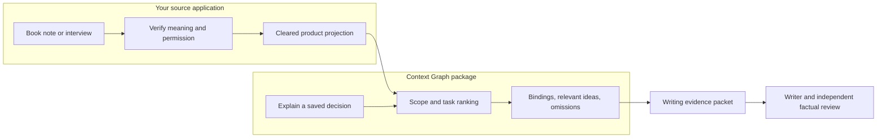
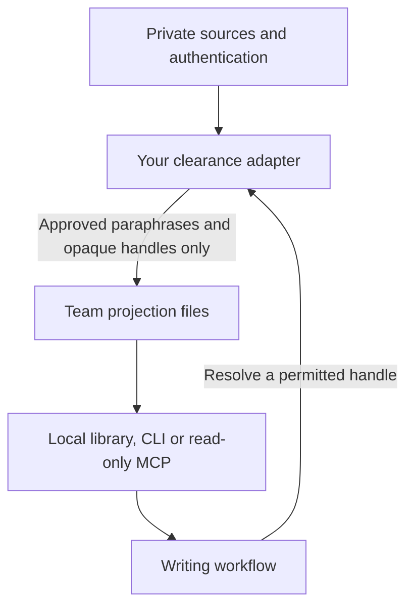

# Integrating the engine

Use the projection API first. Your application turns approved knowledge into projection files; the engine chooses what the task needs. A note-taking product can supply its current feature definition, a rule against unsupported memory claims, and an idea about keeping decisions beside their evidence. A writer then has a concrete explanation and a boundary on what can be claimed.

## The trust boundary

Team files are readable by everyone with repository access. Hashes detect changes; they do not grant rights. The package never resolves a handle to private text, fetches a source, approves a claim or publishes a page. Your adapter must retain evidence type, exclusions and uncertainty during resolution.

## A pinned installation

Pin an exact verified package version, or install a reviewed source tarball while registry publication is unavailable. Record the upstream commit, tarball SHA-256 and `core-manifest.json`. Test a clean installation before updating the installed host. Do not rely on a floating branch or an unverified local checkout.

The canonical implementation lives in `src/core/`. Consumers may import it through package exports. A dependency-free team consumer can vendor `src/core/team.mjs` byte for byte, alongside a receipt containing the upstream commit and corresponding manifest hash. Its update check must compare both the declared source hash and actual vendored bytes. Consumer-specific policy, capture authentication and intent contracts remain adapters, never edits to the vendored file.

For a version upgrade:

1. Verify the new artifact and run the consumer's synthetic contract fixtures.
2. Install compatible readers before producing new delivery receipts or larger exports.
3. Generate and clear projections, refusing any schema, size or privacy failure before replacing last-good files.
4. Regenerate task receipts and verify the installed host actually uses the new pin.
5. Roll back by restoring the previous reviewed pin and compatible projections. Keep historical receipts unchanged.

## Minimum adapter responsibilities

| Responsibility | Evidence to retain |
|---|---|
| Source authenticity and clearance | Original locator/hash and the owning review decision, stored in the appropriate private surface |
| Current product facts | Owning product revision and checked facts; aspirations remain separate |
| Complete candidate export | All eligible product-linked concepts, or an explicit size failure |
| Writing readiness | Bundle hash, algorithm, projection revision, omission report and allowed evidence resolution |
| Current upstream state | Approved projection digest manifest when available; otherwise explicitly unknown |
| Delivery and rollback | Exact installed pin, real invocation and prior compatible artifact |

A clean test suite proves these interfaces behave on its fixtures. It does not prove better writing. Use the separate [writing comparison](writing.md#test-whether-it-helps) to establish that outcome.
