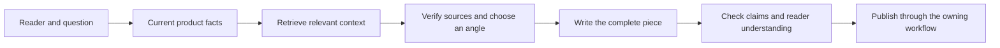

# Writing with context

The useful outcome is a clearer, more specific explanation for a reader. More graph records or a larger prompt do not demonstrate that outcome.

## A practical workflow

1. Define the reader and what the page should help them understand or do. Record current product behavior separately from aspirations.
2. Retrieve the selected product's bundle with `story` and `library`. Keep the hash and omission report.
3. Choose a small number of ideas that explain the product. Resolve their evidence through the owning application. Keep the source locator, why the idea applies, and what it does **not** imply.
4. Build an editorial brief with supported claims, a section map, concrete examples, and relevant constraints. Keep research references separate from binding instructions.
5. Draft and review the complete piece. Check product facts at publication time. Quotes, source naming, personal stories, and testimonials need their own permissions and evidence.

For a synthetic example, a note-taking product might connect the idea of external memory to its actual feature: a decision stored beside its supporting document. That gives a writer a concrete explanation of why the feature exists. It does not establish that the product improves recall or that the author of a book endorsed it.

## Current selection limits

Version 0.1 selects from existing projections. It does not search every book, transcript, or source record for a task. Optional sections have a fixed order: `map` (meaning and relations), `checks`, `claims`, `open` (open decisions), then `ideas`. Word overlap ranks items **within** each section, not across sections. At a tight budget, claims can consume the space before any idea is returned.

`library` and `governance` without `story` select only binding terms, definitions, and decisions. They exclude acceptance requirements and optional ideas without an omission notice. Include `story` to retain acceptance requirements and receive optional ideas; `story` plus `library` selects the same items as `story` alone. The report describes budget omissions, not every potentially useful source absent from the projection or excluded by class. A report with no omissions is not proof of complete research.

The projection client does not resolve handles back to original sources. Applications must provide that path. Summaries can lose conditions, exclusions, and evidence quality; verify the source before turning a summary into a strong claim.

## Test whether it helps

Use a small, predeclared comparison before rolling it across a portfolio:

| Element | Keep or measure |
|---|---|
| Tasks | Representative hero, explanation, story/article, and FAQ tasks, fixed before running |
| Baseline | Current product docs and ordinary repository search |
| Treatment | The same docs plus the graph bundle and source-resolution step |
| Controls | Same model, brief, output budget, editorial passes, and publication rules |
| Blind review | Hide which version used the graph; ask reviewers which better answers the reader's question |
| Value | Source-backed specificity, clarity, product fit, useful depth, time to usable draft |
| Harms | Invented facts, stale claims, misplaced instructions, private disclosures, and unsupported influence claims |

Predeclare the rubric and success threshold, save every attempt, and include failures. Compare time and context cost as well as output quality. A useful idea count is a diagnostic, not the final score. Human reader preference and factual review answer different questions; retain both.

Keep retrieval tests separate from writing tests. Retrieval asks whether the right evidence arrived. Writing asks whether using it improved the result. Passing either does not imply the other passed. Do not tune a held-out set after seeing its misses and continue calling it held out.
